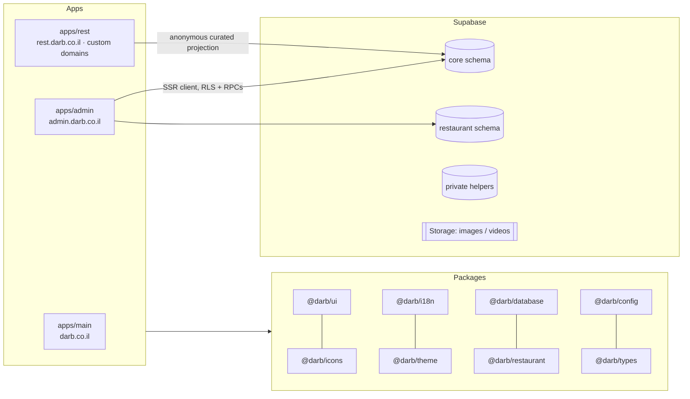

<p align="center">
  <a href="https://darb.co.il/en">
    
  </a>
</p>

<h1 align="center">Darb · درب</h1>

<p align="center">
  Multi-tenant business platform for the Israeli market, built for Arabic, Hebrew, and English.
  <br />
  <a href="https://darb.co.il/en"><strong>darb.co.il</strong></a>
</p>

---

Darb lets a business register, set up its workspace, and publish a customer-facing product on a
Darb subdomain or its own verified domain. The first product is **Darb Restaurant**: a
multilingual digital menu with locations, opening hours, variants, modifiers, branding media, and
selectable premium templates, managed from a shared tenant admin.

The codebase is a TypeScript monorepo with three Next.js applications on a single Supabase
project. Tenant isolation is enforced in Postgres with Row Level Security and narrow RPCs rather
than in application code, and every engine sits behind its own schema and package boundary so new
products can be added without reshaping the platform.

## What is in the repository

| Surface                    | App          | Description                                                                                                                                               |
| -------------------------- | ------------ | --------------------------------------------------------------------------------------------------------------------------------------------------------- |
| `darb.co.il`               | `apps/main`  | Public company site. Static `/ar`, `/he`, `/en` routes, per-locale metadata and hreflang, PWA manifest. No database dependency.                           |
| `admin.darb.co.il`         | `apps/admin` | Registration, email verification, resumable onboarding, tenant workspaces, Restaurant management, and a separate `/platform` console for super admins.    |
| `rest.darb.co.il` + custom | `apps/rest`  | Server-rendered public menus. Resolves platform slugs and verified custom hostnames to one renderer with three templates (Signature, Editorial, Counter). |

### Tenant admin

- Self-service sign-up and a resumable first-business onboarding flow backed by an atomic
  database bootstrap.
- Business settings, locations, languages, media library, custom domains, appearance (template +
  validated theme overrides), and module management under `/b/[businessSlug]`.
- Permission- and module-aware navigation generated from one typed registry and filtered on the
  server per business.
- Restaurant workspace: menus, categories, items, variants, modifier groups, per-location
  availability, hours and contacts, branding media, publication, and launch-readiness checks.
- Fully localized interface in Arabic, Hebrew, and English with correct RTL/LTR layout.

### Platform console

- Cross-tenant views of businesses, users, domains, modules, templates, and the audit log.
- Audited lifecycle changes, plan assignment, and reasoned entitlement overrides. Super-admin
  access to a tenant workspace goes through explicit database authority, not impersonation.

## Architecture



Key decisions:

- **Database-enforced tenancy.** All tenant data is protected by RLS and explicit grants.
  Authorization helpers live in a non-exposed `private` schema. Writes go through narrow RPCs that
  commit the change and its redacted audit event in one transaction. No privileged key is used in
  normal admin flows.
- **Engine boundaries.** Canonical businesses, locations, media, locales, domains, and audit live
  in `core`. Restaurant data lives in its own `restaurant` schema and `@darb/restaurant` package.
  Engine-to-engine imports are not allowed.
- **Fail-closed public reads.** `apps/rest` never reads admin tables. It calls one curated
  anonymous projection that returns the full publication graph (tenant, locales, locations,
  theme, branding, menus, modifiers, hours) in a single round trip, or `null`.
- **Capabilities vs. entitlements.** A module is usable only when it is available, entitled by
  the business plan or an override, enabled by the tenant, and the business is active. The model
  is provider-neutral and carries no billing logic yet.
- **Custom domains.** Ownership is proven with DNS TXT verification; going live additionally
  requires provider attestation from the hosting platform. Verified hosts are rewritten internally
  to the same Restaurant renderer, and canonical URLs prefer the primary live hostname.
- **Theming as a closed contract.** `@darb/theme` maps a fixed token set to CSS variables with
  contrast checks, script-aware typography, direction, and reduced-motion handling. Tenants cannot
  inject arbitrary CSS.
- **Server-first rendering.** React Server Components by default, client components only where
  interaction needs them, shared security headers, and sanitized structured error logging.

## Tech stack

Next.js 16 (App Router, RSC, Server Actions) · React 19 · TypeScript 6 (strict) · Supabase
(Postgres, Auth, Storage, RLS) · pgTAP · Vitest · Playwright · Turborepo · pnpm · ESLint ·
Prettier · Hugeicons / Lucide.

Typography uses Cairo (Arabic), Heebo (Hebrew), and Ubuntu (English). Dates, numbers, and ILS
currency are formatted per locale in the `Asia/Jerusalem` timezone.

## Repository layout

```text
apps/
  main/         Public company website
  admin/        Tenant admin and platform console
  rest/         Public Restaurant renderer
packages/
  config/       ESLint/TS presets, HTTP security headers, observability
  database/     Generated Supabase types and scoped client factories
  i18n/         Locales and text direction
  icons/        Curated icon exports
  restaurant/   Restaurant types and pure domain helpers
  theme/        Theme token contract and resolver
  types/        Platform-wide types
  ui/           Darb identity and admin UI primitives
supabase/
  migrations/   Versioned schema, RLS, and RPC migrations
  tests/        pgTAP database tests, including tenant-isolation tests
tests/e2e/      Playwright suites for main, admin, and rest
docs/           Architecture and design references
```

## Getting started

Requirements: Node.js 22+, pnpm 11 (pinned via `packageManager`), and Docker for the local
Supabase stack.

```bash
pnpm install
cp .env.example .env.local           # fill in Supabase values; apps have their own .env.example

pnpm supabase:start                  # local Postgres, Auth, Storage
pnpm db:reset                        # rebuild the database from migrations
pnpm dev                             # main :3000, admin :3001, rest :3002
```

No tenant data is seeded. Create an account at `http://localhost:3001/register` to go through
onboarding.

## Quality checks

```bash
pnpm lint
pnpm typecheck
pnpm test          # Vitest unit tests
pnpm db:test       # pgTAP: RLS, RPC, and tenant-isolation tests
pnpm db:lint
pnpm build
pnpm test:e2e      # Playwright; starts local Supabase if needed
```

Run `pnpm exec playwright install chromium` once before the first E2E run.

## Documentation

| Topic                                                                                            | Covers                                               |
| ------------------------------------------------------------------------------------------------ | ---------------------------------------------------- |
| [Architecture](./docs/ARCHITECTURE.md)                                                           | App and engine boundaries, data platform, deployment |
| [Database](./docs/DATABASE.md) · [Tenancy](./docs/TENANCY.md)                                    | Schemas, RLS model, memberships, permissions         |
| [Security](./docs/SECURITY.md) · [Auth](./docs/AUTH.md)                                          | Threat boundaries, sessions, bootstrap, audit        |
| [Admin](./docs/ADMIN.md) · [Platform admin](./docs/PLATFORM_ADMIN.md)                            | Tenant workspace and super-admin console             |
| [Modules](./docs/MODULES.md) · [Commercial](./docs/COMMERCIAL.md)                                | Capabilities, plans, entitlements                    |
| [Restaurant](./docs/RESTAURANT.md) · [Launch runbook](./docs/RESTAURANT_LAUNCH.md)               | Restaurant engine, admin, public experience          |
| [Domains](./docs/DOMAINS.md) · [Media](./docs/MEDIA.md)                                          | Custom-domain lifecycle, shared Storage              |
| [Themes](./docs/THEMES.md) · [Design system](./docs/DESIGN_SYSTEM.md) · [Brand](./docs/BRAND.md) | Templates, tokens, visual identity                   |
| [I18n](./docs/I18N.md) · [Production](./docs/PRODUCTION.md)                                      | Localization, deployment, SEO, headers, logging      |

Repository-wide engineering rules are in [`AGENTS.md`](./AGENTS.md).

## Status

Live at [darb.co.il](https://darb.co.il/en). Implemented: platform core, authentication and
onboarding, tenant admin, platform console, plans and entitlements, custom domains, and the
Restaurant product end to end. Not yet implemented: ordering, reservations, payments and billing,
and engines beyond Restaurant.

## Founder

[Darb](https://darb.co.il/en) was founded by **Nour Alden Mousa**, who leads its product,
architecture, and engineering.

## License

Proprietary. © 2026 Darb (darb.co.il). All rights reserved. The source is published for review
and reference; it may not be copied, redistributed, or used commercially without written
permission.
